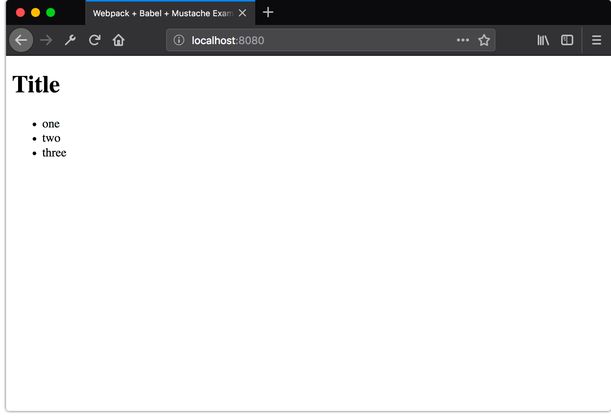

# webpack + babel + mustache

This repository is a small example of how to integrate
[Webpack](https://webpack.js.org/), [Babel](https://babeljs.io/), and the
Mustache templating language
[(via Hogan.js)](http://twitter.github.io/hogan.js/) using some of the newer
features of Webpack (at the time of writing), which include:

- [`webpack-command`](https://github.com/webpack-contrib/webpack-command)
- [`webpack-serve`](https://github.com/webpack-contrib/webpack-serve)
- [Webpack configuration extensions](https://medium.com/@shellscape/webpack-now-with-extended-flavor-b1e57074de77)

## Setup

Clone this repository and run `yarn` to install all necessary dependencies.

Some key files to be aware of:

### `src/index.js`

This is the application entry point. By default, Webpack 4 will bundle the
`src/` directory, unless otherwise specified in your Webpack configuration.

When running the dev server or building production assets, this will be the
entry point used by Webpack to bundle this project.

### `index.html`

This is the HTML file loaded when running the dev server, which references and
loads the dev JavaScript bundle, `bundle.js`, generated by Webpack.

### `config/`

This directory contains 3 Webpack configuration files:

- `base.config.js` - this is a base Webpack configuration that is meant to be
  extended. It includes some common configuration, like setting up the
  [`babel-loader`](https://github.com/babel/babel-loader/tree/7.x) and
  [`mustache-loader`](https://github.com/deepsweet/mustache-loader)
- `dev.config.js` - this extends the base configuration and adds some additional
  properties that are helpful for development
- `prod.config.js` - this also extends the base configuration and adds some
  additional configuration for bundling production-ready assets

## Running the dev server

Run `yarn start` to start the
[`webpack-serve`](https://github.com/webpack-contrib/webpack-serve) dev server.
Once running, visiting localhost:8080 in the browser should show the
application.

## Building for production

## Analyzing production assets

## Questions?

Please
[open an issue](https://github.com/macklinu/webpack-babel-mustache/issues) if
something is unclear, as I would love for this to be a helpful resource for
others as well. :heart:
